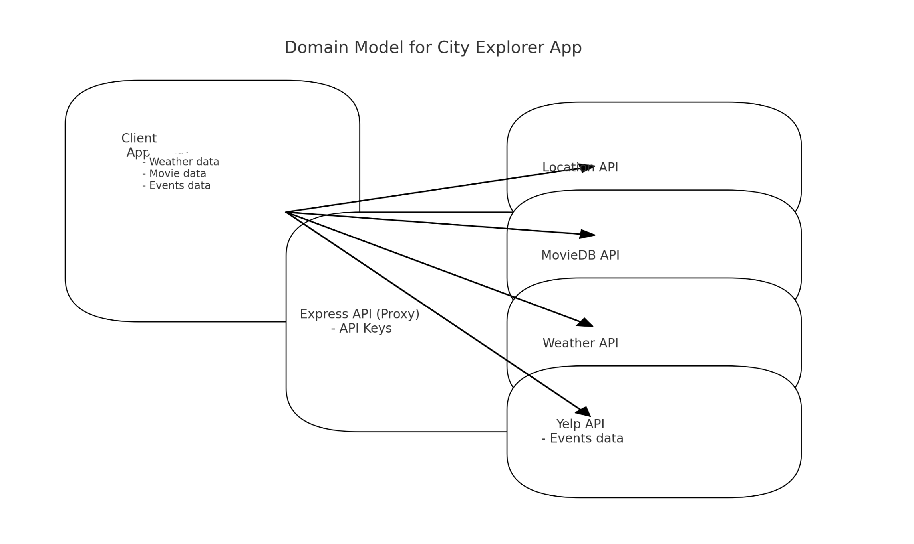

# City Explorer API

City Explorer is an engaging web application that enhances urban exploration with real-time information. It provides detailed maps, current weather forecasts, a curated selection of movies, and popular events in the city. Built with React.js and Bootstrap, and supported by Express.js, City Explorer brings city exploration to life.

## Version

The application is currently at version 1.1, featuring Yelp API integration for events.

## Features

- **API Integration**: Manages API calls for weather and movie data.
- **Data Processing**: Processes and formats data for the frontend application.
- **Security**: Ensures secure data handling and API usage.

## Installation

Set up the City Explorer backend with the following steps:

1. **Clone the Repository**:
   ```bash
   git clone https://github.com/KatKho/city-explorer-api.git
   ```

2. **Navigate to the Project Directory**:
   ```bash
   cd city-explorer-api
   ```

3. **Install Dependencies**:
   ```bash
   npm install
   ```

4. **Environment Configuration**:
   - Create a `.env` file in the project root.
   - Add the following environment variables:
     ```
     PORT=your_port_number
     WEATHER_API_KEY=your_weather_api_key_here
     MOVIE_API_KEY=your_movie_api_key_here
     YELP_API_KEY=your_Yelp_api_key_here
     ```

5. **Run the Server**:
   ```bash
   npm start
   ```

## Domain Modeling

The backend architecture is designed to support efficient data handling and API management.



## Technology Stack

- **Express.js**: The core framework for handling server-side operations and API requests.
- **Node.js**: Provides the runtime environment for the backend services.

## Contact

For questions or contributions, connect with:

- [Ekaterina Khoroshilova](https://www.linkedin.com/in/ekaterina-khoroshilova)
