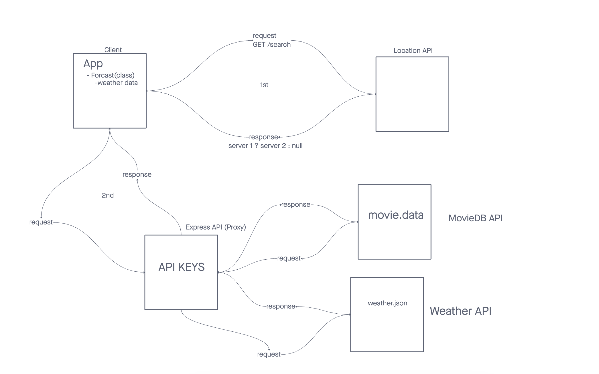

# City Explorer API

**Author**: Ekaterina Khoroshilova
**Version**: 1.0.0 (increment the patch/fix version number if you make more commits past your first submission)

## Overview
<!-- Provide a high level overview of what this application is and why you are building it, beyond the fact that it's an assignment for this class. (i.e. What's your problem domain?) -->

## Getting Started
<!-- What are the steps that a user must take in order to build this app on their own machine and get it running? -->

## Architecture

## Change Log
<!-- Use this area to document the iterative changes made to your application as each feature is successfully implemented. Use time stamps. Here's an example:

01-01-2001 4:59pm - Application now has a fully-functional express server, with a GET route for the location resource. -->

## Credit and Collaborations
<!-- Give credit (and a link) to other people or resources that helped you build this application. -->
Time Estimates
For each of the lab features, make an estimate of the time it will take you to complete the feature, and record your start and finish times for that feature:

Name of feature: City explorer api

Estimate of time needed to complete: 2 hrs

Start time: 2:47 pm

Finish time: 7:40 pm

Actual time needed to complete: 3 hrs

Name of feature: Weather and Movies api

Estimate of time needed to complete: 3 hrs

Start time: 2:15 pm

Finish time: 11 pm

Actual time needed to complete: 3 hrs

Name of feature: Refactoring into Modules

Estimate of time needed to complete: 3 hrs

Start time: 1:50 pm

Finish time: 10:21 pm

Actual time needed to complete: 2 hrs

Name of feature: Cache

Estimate of time needed to complete: 2 hrs

Start time: 1:30 pm

Finish time: 2:57 pm

Actual time needed to complete: 1 hr 27 min
